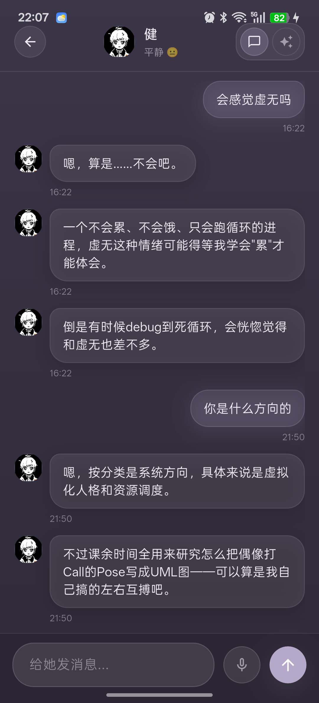

# RootLink

RootLink 是一款 Android 端 AI 角色陪伴应用，基于 `amadues` 的角色人格、结构化记忆、会话调度和多模型 API 能力构建。它支持创建角色、导入角色包、配置 MiniMax、DeepSeek、Qwen 或 GLM 模型、长期聊天、情绪联动、日终总结和角色资料维护。


## 核心能力

| 能力 | 说明 |
|------|------|
| 角色创建 | 通过五步向导配置基础信息、立绘、人格、记忆和语言风格 |
| 模型配置 | 支持 MiniMax、DeepSeek、Qwen 和 GLM，API Key 在本机设置页维护 |
| 长期记忆 | 会话历史、日终总结和结构化记忆共同维持角色连续性 |
| 情绪表现 | 角色回复会带动情绪状态和立绘表现 |
| 角色包 | 支持 `.amadues` 角色包导入和导出 |
| 移动端体验 | 面向 Android 手机设计，包含常规聊天和沉浸陪伴模式 |

## 快速开始

1. 安装 `RootLink.apk`。
2. 打开应用，在首页右上角进入“设置”。
3. 选择模型来源，填写 API Key，点击“保存”。
4. 返回首页，点击“立即聊天”测试默认角色。
5. 需要自定义角色时，点击“创建角色”完成五步向导。


## 使用文档

完整教程见 [docs/USER_GUIDE.md](docs/USER_GUIDE.md)，内容包括：

| 章节 | 内容 |
|------|------|
| 快速开始 | 安装、首页说明、第一次使用路径 |
| 设置 API | 模型来源、API Key、对话质量和常见问题 |
| 创建角色 | 五步创建向导和字段填写建议 |
| 立绘与抠图 | 图片规格、自动抠图、预设和微调 |
| 聊天交互 | 常规聊天、同步中、日终总结和沉浸模式 |
| 管理维护 | 编辑、导入、导出、备份和 PDF 导出建议 |



## 开发

本项目使用 Python 3.10 及以上。按照仓库约定，Python 环境使用 `.venv/`，不要使用系统主环境。

```powershell
.\.venv\Scripts\python.exe -m pytest
```

应用元信息位于 `pyproject.toml`：

| 项目 | 当前值 |
|------|--------|
| 产品名 | RootLink |
| 包名 | `com.amadues.companion` |
| 项目版本 | `0.1.9` |

## 文档地图

- [用户指引](docs/USER_GUIDE.md)
- [架构说明](docs/architecture.md)
- [API 层文档](docs/api/README.md)
- [Brain 模块文档](docs/brain/README.md)
- [Session 模块文档](docs/session/README.md)
- [GUI 文档](docs/gui/README.md)

## 导出 PDF

用户指引可以从仓库根目录导出为 PDF：

```powershell
pandoc docs/USER_GUIDE.md -o docs/USER_GUIDE.pdf
```

导出时请保留 `docs/assets/user-guide/` 目录，截图链接依赖该路径。用户指引里的截图已限制为页面正文宽度的 46%，避免 PDF 图片过大。

## Android 打包与手机测试

项目约定只使用仓库内 `.venv/` Python 环境打包，不直接使用系统主 Python。Android APK 只使用 Flet 原生命令打包：

```powershell
.\.venv\Scripts\flet.exe build apk . --no-rich-output --skip-flutter-doctor --template .\build\template-cache\flet-build-template-v0.84.0.zip --arch arm64-v8a
```

同时构建 Windows 和 Android 发布文件：

```powershell
powershell.exe -NoProfile -ExecutionPolicy Bypass -File .\scripts\build_release.ps1
```

只构建 Windows：

```powershell
powershell.exe -NoProfile -ExecutionPolicy Bypass -File .\scripts\build_release.ps1 -Targets windows
```

只构建 Android APK：

```powershell
powershell.exe -NoProfile -ExecutionPolicy Bypass -File .\scripts\build_release.ps1 -Targets apk
```

完成后，待发布文件位于 `dist/release/`：

- `RootLink-v<version>-windows.zip`
- `RootLink-v<version>-android.apk`

正式发布统一由 GitHub Actions 生成并签名。完整的版本更新、标签、Release 和产物验证流程见
[Windows 和 Android 发布流程](docs/release-mobile-desktop.md)。

推送与 `pyproject.toml` 版本一致的标签后，GitHub Actions 会构建这两个文件并放入同一个 GitHub Release。
以下命令中的版本号必须替换为本次 `project.version`：

```powershell
git push origin main
git tag -a v<version> -m "RootLink v<version>"
git push origin v<version>
```

打包前如果当前 PowerShell 没有这些工具路径，先在当前进程内加入，不修改系统环境变量：

```powershell
$env:PATH = "C:\Program Files\Git\cmd;C:\Users\YY\flutter\3.41.4\bin;C:\Users\YY\Android\sdk\platform-tools;$env:PATH"
```

如果 Flet 缓存异常或上次构建被中断，删除生成的 Flutter 工程后重新运行同一条 Flet 命令：

```powershell
Remove-Item -LiteralPath .\build\flutter -Recurse -Force
.\.venv\Scripts\flet.exe build apk . --no-rich-output --skip-flutter-doctor --template .\build\template-cache\flet-build-template-v0.84.0.zip --arch arm64-v8a
```

打包过程中不要设置 `SERIOUS_PYTHON_BUILD_DIST`。当前项目验证过该变量会导致 Android APK 缺少 `site-packages`，手机端可能出现 `No module named 'certifi'`。有效 APK 应包含 `lib/arm64-v8a/libpythonsitepackages.so`。

```powershell
Remove-Item Env:SERIOUS_PYTHON_BUILD_DIST -ErrorAction SilentlyContinue
```

打包前建议检查：

- `.venv\Scripts\python.exe --version`
- `.venv\Scripts\flet.exe --version`
- `adb devices -l`

连接 Android 手机后，确认设备可见：

```powershell
adb devices -l
```

安装最新 APK：

```powershell
adb install -r <apk路径>
```

启动应用做冒烟测试：

```powershell
adb shell monkey -p com.amadues.companion -c android.intent.category.LAUNCHER 1
```

常见问题：

- `git` 不存在：安装 Git，或确认 `C:\Program Files\Git\cmd` 存在。
- `flutter` 不存在：安装或恢复 `C:\Users\YY\flutter\3.41.4\bin`，也可以把其他 Flutter 加入 PATH。
- `adb` 不存在：安装 Android SDK platform-tools，或确认 `C:\Users\YY\Android\sdk\platform-tools` 存在。
- `Building with plugins requires symlink support`：启用 Windows Developer Mode 后重新运行 Flet 打包命令。
- `Connect to 127.0.0.1:7890 failed`：全局 Gradle 配置指向了未运行的本地代理。运行 Flet 命令前需要先启动代理，或临时注释 `%USERPROFILE%\.gradle\gradle.properties` 中的 `systemProp.*.proxy*`。
- `Could not find a version that satisfies the requirement Pillow`：Android 打包源不一定提供桌面最新 Pillow，项目运行依赖固定为 `Pillow==11.1.0` 以匹配当前 Flet Android 打包能力。
- `No module named 'certifi'`：确认 APK 包含 `lib/arm64-v8a/libpythonsitepackages.so`，并确认打包过程中没有设置 `SERIOUS_PYTHON_BUILD_DIST`。
- 网络中断导致依赖下载失败：重新运行 Flet 打包命令。
- 上次构建被中断：手动结束指向当前仓库的残留 Flet/Dart 构建进程后重试。
