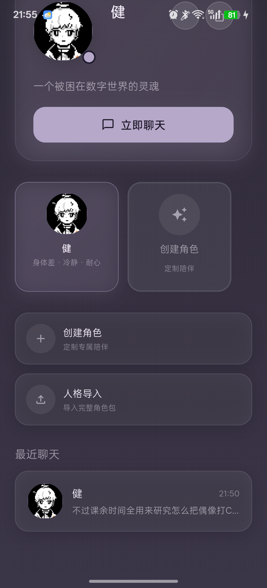
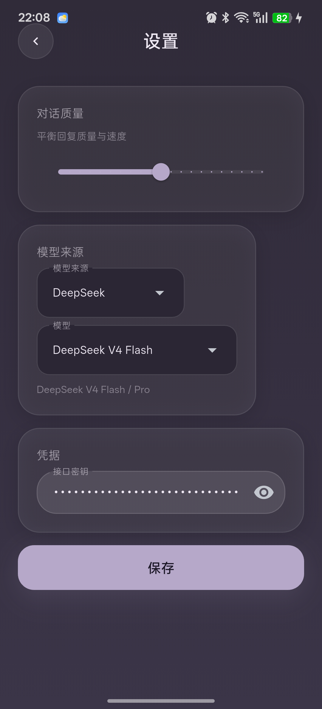
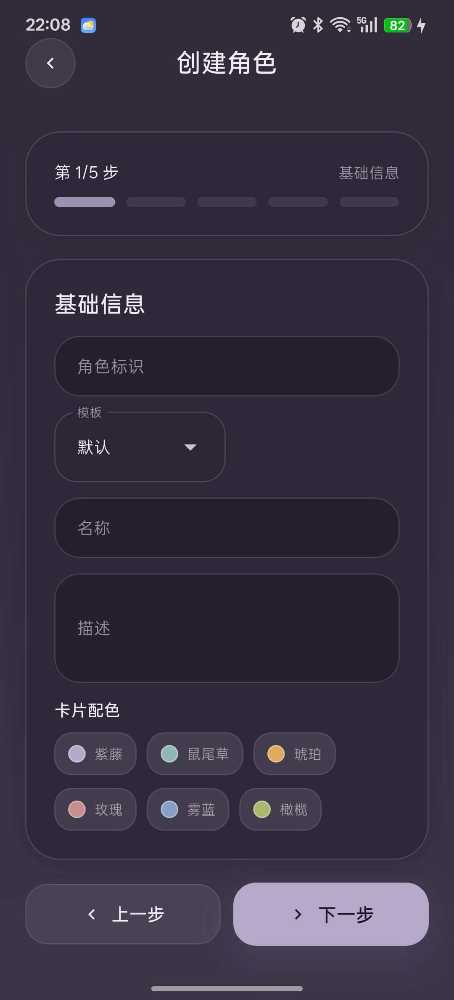
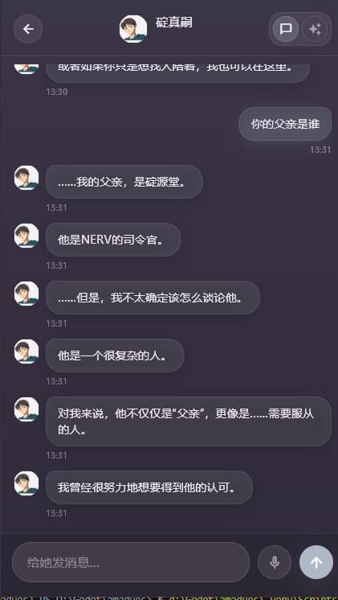

# RootLink 用户指引

RootLink 是一款运行在 Android 端的 AI 角色陪伴应用。它把角色资料、长期记忆、每日会话、情绪标签、立绘表情和模型配置组织在同一个体验里，让用户可以创建、导入、维护并长期使用自己的角色。


{ width=46% }

## 目录

1. [快速开始](#1-快速开始)
2. [设置 API](#2-设置-api)
3. [创建你的第一个角色](#3-创建你的第一个角色)
4. [立绘与抠图](#4-立绘与抠图)
5. [聊天交互](#5-聊天交互)
6. [管理与维护](#6-管理与维护)

## 1. 快速开始

RootLink 当前主要面向 Android 手机使用。首次安装后，应用会准备一个默认角色，用户也可以从首页创建新角色或导入 `.amadues` 角色包。

### 1.1 准备环境

| 项目 | 要求 |
|------|------|
| 系统 | Android 9.0 及以上 |
| 网络 | 对话功能需要访问所选模型提供商 |
| 模型账号 | MiniMax 或 DeepSeek API Key |
| 存储权限 | 导入角色包、导出角色包、选择头像或立绘时需要文件访问能力 |

### 1.2 安装应用

1. 获取 `RootLink.apk`。
2. 在手机上打开 APK 文件。
3. 如果系统提示“未知来源应用”，允许本次安装。
4. 安装完成后打开 RootLink。


### 1.3 认识首页

首页是所有操作的入口，主要包含这些区域：

| 区域 | 用途 |
|------|------|
| 顶部主题按钮 | 在日间和夜晚主题之间切换 |
| 顶部设置按钮 | 进入模型、API Key 和对话质量设置 |
| 当前角色卡片 | 查看角色头像、名称、简介，进入聊天、编辑或导出 |
| 角色快捷卡片 | 在已有角色之间快速切换 |
| 创建角色 | 启动五步创建向导 |
| 人格导入 | 导入 `.amadues` 或兼容 zip 角色包 |

首次打开时，如果默认角色已经存在，可以直接点击“立即聊天”。如果未配置 API Key，仍可以进入聊天页，但发送消息时会因为模型凭据缺失而无法获得真实回复。

### 1.4 推荐第一次使用流程

1. 打开 RootLink。
2. 进入“设置”，选择模型来源并填写 API Key。
3. 返回首页，点击“立即聊天”测试对话。
4. 如果要使用自定义角色，点击“创建角色”完成五步向导。
5. 创建完成后，在首页选择新角色并开始聊天。

## 2. 设置 API

对话能力由模型提供商驱动。RootLink 会把界面设置和模型凭据分开保存，API Key 只用于本机调用所选模型服务。

{ width=46% }

### 2.1 进入设置

在首页右上角点击设置按钮，进入“设置”页面。页面顶部有返回按钮，保存后会自动返回首页。

### 2.2 调整对话质量

“对话质量”滑块用于平衡回复质量和速度：

| 位置 | 适合场景 |
|------|----------|
| 较低 | 想要更快响应，或网络条件不稳定 |
| 中间 | 日常聊天，速度和质量相对均衡 |
| 较高 | 更重视表达质量、上下文理解和角色一致性 |

建议第一次使用保持默认值，确认 API 正常后再调整。

### 2.3 选择模型来源

| 提供商 | 可选模型 | 建议用途 |
|--------|----------|----------|
| MiniMax | MiniMax-M2.5 | 成本和稳定性较均衡 |
| DeepSeek | DeepSeek V4 Flash | 响应速度优先 |
| DeepSeek | DeepSeek V4 Pro | 回复质量优先 |

建议使用 DeepSeek V4 Flash。

### 2.4 填写 API Key

在“凭据”区域填写 API Key。输入框默认以密文显示，可以点击右侧显示按钮临时查看。

API Key 获取入口：

| 提供商 | 地址 |
|--------|------|
| MiniMax | <https://platform.minimaxi.com> |
| DeepSeek | <https://platform.deepseek.com> |

填写后点击“保存”。保存成功后，设置会立即生效，后续聊天会使用新的提供商、模型和密钥。

### 2.5 常见配置问题

| 现象 | 处理方式 |
|------|----------|
| 发送后没有回复 | 检查 API Key 是否为空、是否选错提供商、手机是否联网 |
| 回复很慢 | 降低对话质量，或切换到 Flash 类型模型 |
| 回复不符合角色 | 检查角色背景、特质、兴趣和初始记忆是否写得过宽或互相冲突 |
| 保存后仍使用旧模型 | 返回设置页确认模型名称，再点击保存；必要时重启应用 |

## 3. 创建你的第一个角色

RootLink 的角色不是单个 prompt，而是一组结构化资料：基础信息、形象资源、人格设定、初始记忆和语言风格会共同影响聊天表现。

{ width=46% }

从首页点击“创建角色”，进入五步创建向导。底部按钮用于上一步和下一步。最后一步点击“创建”后，角色会出现在首页。

### 3.1 第一步：基础信息

| 字段 | 说明 | 建议 |
|------|------|------|
| 角色标识 | 角色的唯一 ID，创建后用于数据目录和角色包 | 使用小写英文、数字和短横线，例如 `system-ken` |
| 模板 | 角色初始行为风格 | 第一次建议使用“默认” |
| 名称 | 首页和聊天页显示的角色名 | 选一个短名称，手机界面更清晰 |
| 描述 | 首页角色卡片上的一句话介绍 | 控制在一句话内 |
| 卡片配色 | 首页角色卡片和主要按钮的强调色 | 选择和角色气质接近的颜色 |

基础信息的目标是“能识别这个角色是谁”。不要把完整背景全部塞进描述，详细设定放到第三步“人格”更合适。

### 3.2 第二步：立绘

立绘决定聊天页和沉浸模式里的角色视觉表现。一个角色至少需要头像，推荐准备默认立绘；如果希望情绪联动更自然，再补充开心、难过、生气、惊讶等表情。

| 项目 | 说明 |
|------|------|
| 头像 | 首页角色卡、聊天顶栏和消息头像使用 |
| 默认立绘 | 沉浸模式和角色展示的基础形象 |
| 情绪立绘 | AI 回复被识别为特定情绪时自动切换 |
| 渲染模式 | 可以选择分割模式或原图模式 |

图片建议使用清晰正面或半身图。背景越干净，自动抠图越稳定。

### 3.3 第三步：人格

人格信息决定角色长期的身份感和表达边界。

| 字段 | 说明 |
|------|------|
| 年龄 | 可选，角色年龄或年龄段 |
| 性别 | 可选，用于角色自称和他人称呼 |
| 生日 | 可选，建议使用 `YYYY-MM-DD` |
| 背景 | 角色经历、研究方向、生活习惯和重要设定 |
| 语言风格预设 | 友好、冷静、自信、直接等基础说话倾向 |
| 特质 | 例如冷静、耐心、脱线、敏锐 |
| 兴趣 | 例如游戏、音乐、偶像应援、系统研究 |

背景写法建议：


好的背景应该具体，但不要塞入互相矛盾的要求。角色设定越稳定，后续记忆和日终总结越容易维持一致。

### 3.4 第四步：记忆

初始记忆用于告诉角色“已经发生过什么”或“必须长期记住什么”。

| 字段 | 说明 |
|------|------|
| 内容 | 记忆正文 |
| 类型 | 情景记忆、偏好记忆、事实记忆、日常摘要、月度摘要 |
| 重要性 | 数值越高，对回复影响越大 |
| 上下文 | 记忆来源，例如“初次见面”“用户偏好” |

建议先添加少量高质量记忆。过多初始记忆会让角色更难抓住重点。

示例：

| 类型 | 内容 |
|------|------|
| 事实记忆 | 用户希望角色记住自己的称呼和边界 |
| 偏好记忆 | 用户喜欢简洁直接的回答，不喜欢过度解释 |
| 情景记忆 | 角色第一次见到用户时表现得有些拘谨 |

### 3.5 第五步：语言风格

语言风格控制角色如何说话，而不是角色知道什么。

| 设置 | 影响 |
|------|------|
| 词汇水平 | 简单、普通或学术 |
| 句子长度 | 短句、中句、长句或动态变化 |
| 感叹频率 | 是否经常使用感叹语气 |
| 提问频率 | 是否主动反问或追问 |
| 省略号频率 | 是否保留停顿感 |
| Emoji 使用 | 是否在回复中使用表情符号 |
| 括号使用 | 是否用括号补充动作或旁白 |
| 记忆影响力 | 记忆对当前回复的权重 |

创建完成后，建议先进行 3 到 5 轮短对话。如果角色表达偏差明显，优先回到人格和语言风格两步调整，不要急着堆更多记忆。

## 4. 立绘与抠图

RootLink 支持把上传的角色图自动处理成适合移动端显示的立绘资源。抠图结果会用于角色展示和沉浸聊天。

### 4.1 推荐图片规格

| 项目 | 建议 |
|------|------|
| 格式 | PNG 或 JPG |
| 构图 | 正面、半身或全身，主体完整 |
| 背景 | 单色、浅色或对比明显的背景 |
| 清晰度 | 长边建议不低于 1000 像素 |
| 边缘 | 头发、衣服边缘不要和背景颜色过于接近 |

### 4.2 上传流程

1. 在创建或编辑角色时进入“立绘”步骤。
2. 选择要设置的情绪，例如默认、开心或难过。
3. 点击“更换立绘”。
4. 从手机文件中选择图片。
5. 查看预览效果。
6. 如果边缘不理想，展开高级设置进行微调。

### 4.3 抠图预设

| 预设 | 适合情况 |
|------|----------|
| 保守 | 主体和背景颜色接近，担心误删人物边缘 |
| 标准 | 大多数图片，推荐优先尝试 |
| 强力 | 背景和主体反差明显，但残留背景较多 |

### 4.4 高级微调

| 设置 | 作用 |
|------|------|
| 背景清理强度 | 控制背景像素移除力度 |
| 缩放 | 调整人物在画布中的大小 |
| 横向偏移 | 左右移动人物 |
| 纵向偏移 | 上下移动人物 |
| 渲染模式 | 在分割模式和原图模式之间切换 |

### 4.5 常见立绘问题

| 现象 | 处理方式 |
|------|----------|
| 人物边缘被吃掉 | 降低清理强度，或改用保守预设 |
| 背景残留明显 | 提高清理强度，或改用强力预设 |
| 人物太小 | 增大缩放 |
| 人物偏左或偏右 | 调整横向偏移 |
| 抠图一直不理想 | 换一张背景更干净的原图，或使用原图模式 |

## 5. 聊天交互

聊天页负责日常对话、历史展示、情绪状态和同步状态。点击首页“立即聊天”即可进入。


{ width=46% }

### 5.1 常规聊天

常规聊天页包含：

| 区域 | 用途 |
|------|------|
| 顶部栏 | 返回首页、查看角色头像、名称和当前情绪 |
| 模式按钮 | 在常规聊天和沉浸陪伴之间切换 |
| 消息区 | 显示用户消息和角色回复 |
| 输入框 | 输入文本消息 |
| 麦克风按钮 | 预留语音输入入口 |
| 发送按钮 | 发送当前文本 |

发送消息后，用户消息会先显示在右侧，角色回复显示在左侧。角色回复会带有时间，并根据识别出的情绪更新顶部状态和立绘表现。

### 5.2 同步中状态

当进入聊天页时，如果应用正在同步历史、检查跨日摘要或加载会话，不会阻塞页面打开。界面会先显示可交互的聊天页，并在后台继续处理同步任务。

用户能看到的效果是：

| 状态 | 行为 |
|------|------|
| 同步中 | 聊天页可打开，历史和摘要任务继续在后台运行 |
| 同步完成 | 历史、日终总结和记忆写回按当前状态刷新 |
| 同步失败 | 不影响进入页面，但后续回复或总结可能需要重试 |

如果跨过日期后没有马上看到日终总结，先保持应用打开片刻，再进入聊天页触发会话同步。仍未生成时，检查 API Key、网络和模型响应是否正常。

### 5.3 日终总结和记忆

RootLink 会围绕角色会话维护历史与摘要。日终总结的作用是把一天里的关键对话压缩成长期可用的上下文，避免角色只依赖完整聊天记录。

日终总结通常在这些时机触发：

| 时机 | 说明 |
|------|------|
| 打开聊天页 | 应用检查是否存在需要归档的前一日会话 |
| 发送新消息 | 会话管理器有机会继续完成未处理的摘要任务 |
| 应用恢复运行 | 如果上次退出前任务未完成，会在后续同步中继续 |

生成总结需要模型调用。如果 API Key 不可用、网络失败或提供商返回错误，总结可能延迟到下一次同步。

### 5.4 沉浸陪伴

聊天页右上角的模式按钮可以切换到沉浸陪伴。沉浸模式更适合查看立绘、表情联动和较长回复。

沉浸模式下：

| 能力 | 说明 |
|------|------|
| 全屏角色展示 | 角色立绘占据主要视觉区域 |
| 情绪联动 | 回复情绪会驱动立绘和状态变化 |
| 打字机效果 | 文本逐段显示，模拟角色正在说话 |
| 点击推进 | 可跳过当前动画或进入下一段 |

如果角色没有对应情绪立绘，应用会回退到默认立绘。

### 5.5 让角色更稳定的聊天方式

| 目标 | 建议 |
|------|------|
| 保持人格一致 | 不要频繁要求角色否定自己的核心设定 |
| 让角色记住偏好 | 用明确句子表达，例如“以后请记住我更喜欢短回答” |
| 修正错误设定 | 去编辑角色的人格或记忆，而不是只在聊天里纠正 |
| 提高回复质量 | 使用更高质量模型，或提高对话质量滑块 |

## 6. 管理与维护

角色长期使用后，会积累头像、立绘、历史、摘要和记忆。建议定期导出重要角色包，避免误删或换机时丢失。

### 6.1 编辑角色

在首页当前角色卡片上点击编辑按钮，进入和创建流程相同的五步编辑界面。编辑后点击保存，新的资料会应用到后续聊天。

适合编辑的内容：

| 内容 | 场景 |
|------|------|
| 描述 | 首页展示不准确 |
| 背景 | 角色身份、经历或研究方向需要修正 |
| 特质和兴趣 | 角色表现过于单一或偏离设定 |
| 初始记忆 | 需要补充重要事实 |
| 语言风格 | 回复过长、过短或语气不合适 |

### 6.2 导出角色包

点击当前角色卡片上的导出按钮，可以生成 `.amadues` 角色包。角色包适合用于备份、迁移和分享。

导出前建议确认：

| 检查项 | 原因 |
|--------|------|
| 名称和描述正确 | 方便导入后识别 |
| 头像和立绘已设置 | 避免分享后缺少视觉资源 |
| 背景没有隐私信息 | 角色包可能被转发 |
| 聊天记录是否适合保留 | 根据实际导出内容决定是否清理 |

### 6.3 导入角色包

在首页点击“人格导入”，选择 `.amadues` 文件或兼容 zip 文件。导入后角色会加入首页列表。

如果角色 ID 已经存在，按应用提示选择覆盖或取消。覆盖前建议先导出现有角色作为备份。

### 6.4 删除或替换角色

删除角色前请先导出备份。删除通常会移除该角色关联的资料和资源，操作不可撤销。

如果只是想调整设定，优先使用编辑角色；如果要重做角色，再考虑导出备份后删除。

### 6.5 数据维护建议

| 频率 | 建议 |
|------|------|
| 每次大改角色前 | 先导出 `.amadues` 包 |
| 每次换模型前 | 简单测试 2 到 3 轮聊天 |
| 每周 | 检查角色记忆是否过多或互相冲突 |
| 换手机前 | 导出所有重要角色包 |

### 6.6 导出 PDF 和维护 GitHub 主页

本文档使用相对图片路径，建议从仓库根目录执行导出：

```powershell
pandoc docs/USER_GUIDE.md -o docs/USER_GUIDE.pdf
```

文档截图已经在 Markdown 中使用 Pandoc 图片宽度属性限制为页面正文宽度的 46%，导出的 PDF 会保留手机截图比例，但不会按原始像素尺寸撑满页面。

GitHub 首页建议使用根目录 `README.md` 作为简明入口，保留产品介绍、截图、快速开始和文档链接；详细步骤继续维护在 `docs/USER_GUIDE.md`。这样 README 不会过长，PDF 又能包含完整指引。

---

RootLink：在一切连接的原点，遇见你的角色。
