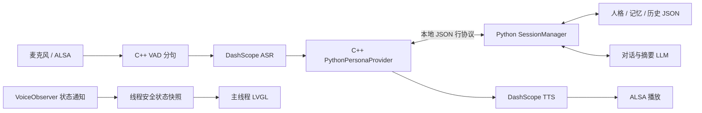
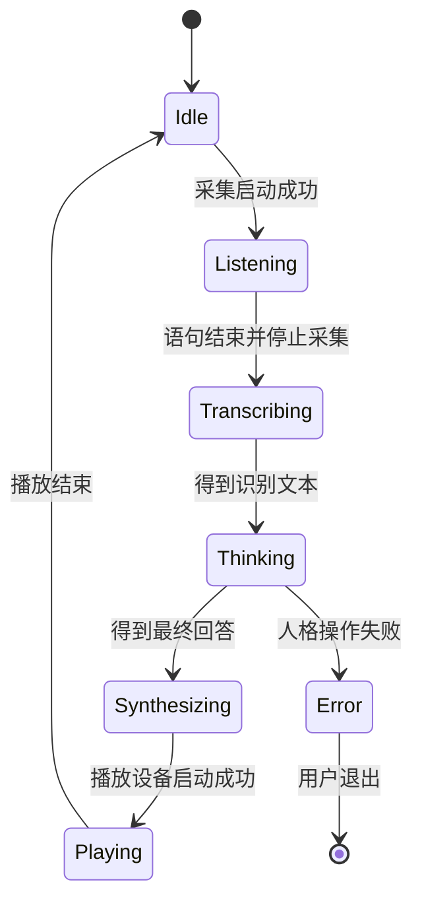

# RootLink 语音终端开发手册

文档更新：2026-09-07。本文描述截至 2026-09-06 已完成构建验证的实际实现，范围为 `embedded/rv1106` 语音终端及其复用的 `src/agent_core`。配置与启动步骤见 [用户手册](USER_MANUAL.md)，构建细节见 [BUILDING.md](BUILDING.md)，验证边界见 [VALIDATION.md](VALIDATION.md)。

## 1. 架构与职责

项目保留一份 Python 人格核心。桌面端与嵌入式无界面入口复用 `SessionManager`，人格 Prompt、状态、关系、记忆、历史恢复和日月摘要都在 Python 中实现。C++ 管理设备、语音流程、ASR/TTS、进程生命周期与显示。部署包复制共享源码作为发布快照，不维护另一套嵌入式人格逻辑。



`PERSONA_BACKEND=python` 时，C++ 只提交本轮用户文本，不拼接人格 Prompt、不直接调用对话 LLM、不追加另一份 C++ 历史。`simple` 后端仍保留用于旧配置和离线回归；Python 出错时不会自动切回它。

首版一个进程只加载一个角色，串行处理消息，不注册工具执行能力。当前语音模式按轮次采集，处理与播放期间停止录音；不是全双工对话，也没有播放打断或回声消除链路。

## 2. 代码导航

以下 C++ 路径相对 `embedded/rv1106`，Python 路径相对 RootLink 仓库根目录。

| 路径 | 职责 |
| --- | --- |
| `src/app/voice_main.cpp` | CLI、配置加载、provider 装配、信号、UI 主循环与语音线程 |
| `include/rootlink/audio`、`src/audio` | 统一 PCM 格式、ALSA/模拟设备、环形缓冲、WAV、音频会话 |
| `src/voice/vad.cpp` | 自适应能量 VAD、前置缓冲、起止判定与分句 |
| `src/voice/voice_runtime.cpp` | 一轮 ASR → 人格 → TTS → 播放的状态机与统计 |
| `include/rootlink/voice/providers.h` | ASR、LLM、TTS、HTTP 等接口和取消约定 |
| `src/voice/runtime_config.cpp` | KEY=VALUE、环境变量、模型配置、密钥解析与参数校验 |
| `src/voice/cloud_providers.cpp`、`curl_http_client.cpp` | DashScope ASR/TTS、简化后端 LLM、HTTPS、响应解析与有限重试 |
| `src/voice/python_persona.cpp` | Python 常驻进程、JSON 行协议、请求 ID、超时与回收 |
| `src/voice/role.cpp` | 简化 C++ 后端的角色、Prompt 和会话持久化 |
| `src/ui/main_view.cpp`、`include/rootlink/ui/main_view.h` | 状态快照、符号映射、LVGL、SDL/framebuffer 生命周期 |
| `scripts/persona-worker.py` | 共享 Python 包的无界面启动入口 |
| `src/agent_core/headless.py` | 协议服务、角色种子导入、目录锁、模型映射、SessionManager 创建 |
| `src/agent_core/session/manager.py` | 多轮会话编排、流式回答、状态与历史更新、摘要触发 |
| `src/agent_core/session/prompt_builder.py`、`brain/prompt_builder.py` | 会话提示组织与人格核心提示构建 |
| `src/agent_core/brain` | 人格、历史、记忆相关配置与持久化、标签、说话风格、轻量 token 估算 |
| `src/agent_core/api` | ChatAgent、模型配置、供应商请求与响应适配 |
| `scripts/package-python-core.py` | ARM Python 与依赖闭包、核心源码、证书、manifest 和部署归档 |

修改人格行为应进入共享 `agent_core`；修改设备、传输或 UI 时进入相应 C++ 模块。不要在 UI 或 ASR/TTS provider 中引入人格数据写入。

## 3. 音频流程和状态机

内部格式固定为 **16000 Hz、单声道、16 位 PCM、20 ms 一帧**，每帧 320 个采样、640 字节。`AudioConfig::validate()` 拒绝不一致的格式，录音、VAD、WAV 和播放使用同一约定。当前不是通过配置切换任意采样率的音频框架。

VAD 使用 RMS、动态噪声估计和连续帧确认；默认连续 3 帧启动，保留 400 ms 前置音频，800 ms 静音结束，最大语句 30 秒。过短片段会被丢弃。分句完成后停止采集，顺序调用服务；播放末尾不足一帧时补静音，完成后重新开启采集。



图展示主路径；任一设备或服务阶段都可能失败或取消。Python 后端下本轮错误会停止语音流程，不自动重放。简化后端保留现有非致命错误后继续采集的策略。界面另有故障锁存，后续清理发出的 Idle 不会覆盖 `×`。

## 4. C++ 与 Python 的进程接口

`PythonPersonaProvider` 使用 `posix_spawn` 和独立 argv 启动配置的解释器、入口，不经 shell 拼接。实现通过 socketpair 将子进程标准输入/输出连接到父进程，父端非阻塞读写；没有网络监听端口，也不逐轮启动解释器。

协议是 UTF-8 JSON Lines：版本 `v=1`，每行必须以换行结束，请求 ID 为严格递增正整数，事件回显 ID。单行上限 2 MiB，用户文本上限 128 KiB。

| 操作 | 输入字段 | 正常事件 |
| --- | --- | --- |
| `init` | `settings`，包括 model、role_dir、data_dir、llm_timeout_ms | `ready` |
| `message` | `text` | 零个或多个 `delta`，然后 `done` |
| `health` | 无额外字段 | `ready` |
| `shutdown` | 无额外字段 | `done`，随后退出 |

```json
{"v":1,"id":2,"op":"message","text":"你好"}
{"v":1,"id":2,"event":"delta","text":"你好。"}
{"v":1,"id":2,"event":"done","text":"你好。"}
```

失败返回 `event=error` 与固定 `code=core_failed`，避免把带密钥或响应正文的异常直接传回日志。初始化完整示例见 [PYTHON_CORE.md](PYTHON_CORE.md#数据协议与故障)。密钥经私有进程通道传给核心，不进入命令行；协议本身不是可公开打印的诊断日志。

标准输出仅承载协议。无界面入口抑制旧核心的 stdout/stderr 和 logging；C++ 错误提示写 stderr。新增诊断应使用经过脱敏的固定状态，不能直接输出完整设置、请求或供应商异常。

`delta` 只用于文本反馈，TTS 仅接收 `done.text`。Python 流要求完整结束，禁用失败后的同步回退。默认启动握手超时 30 秒、完整人格操作超时 300 秒，后者包含本轮可能触发的摘要；两项可配置。EOF、非法协议、超时、退出或取消导致当前操作失败并回收子进程，不自动重试整轮人格消息。

## 5. Python 人格核心与数据所有权

无界面入口通过 `create_manager()` 创建 `ModelConfig`、`ChatAgent`、`BrainRegistry` 和 `SessionManager`。启用 JSON 存储、`heuristic / hybrid_v1` 轻量 token 估算，关闭 function calling，传入空工具集合。

首次启动要求 `ROLE_DIR/persona/profile.json` 有效且非空。入口复制 profile、state、memories、speaking_style 和可选 `config.json` 到运行目录的临时种子目录，再重命名为 `PYTHON_DATA_DIR/default`。后续不重复导入；种子与运行数据路径不能相同或互相包含。

`PYTHON_DATA_DIR/.core.lock` 的进程锁防止多个 worker 同时写同一角色数据。核心独占人格、记忆、历史写入，复用现有 JSON 格式和持久化规则；`default/history/history.json` 保存核心历史，会话与摘要文件沿用 PathResolver/SessionStorage 的布局。备份和恢复应针对整个数据目录。

会话核心基于人格、关系状态、记忆和受预算约束的历史构造 Prompt，再调用模型；流完成后沿用共享核心处理与保存回答。跨日、跨月摘要按 SessionManager 现有触发规则运行，不另设定时进程。

持久化不是整轮事务：LLM 失败前可能已保存用户消息或更新部分状态。进程重启恢复已落盘内容，不代表自动回滚到本轮之前；不重放请求可以避免重复调用和重复状态推进。摘要的非致命失败规则仍由共享核心决定。

### 配置映射边界

| C++ 运行配置 | Python 接收或使用的位置 |
| --- | --- |
| `LLM_PROVIDER`、`LLM_MODEL`、解析后的 base_url / api_key | `settings.model` → `ModelConfig` |
| models.json 的 `headers`、`auth_header`、`chat_path` | ChatAgent 传输设置 |
| `LLM_TIMEOUT_MS` | `request_timeout`，从毫秒转秒 |
| `ROLE_DIR`、`PYTHON_DATA_DIR` | 初始种子与独立运行数据目录 |
| `PERSONA_START_TIMEOUT_MS`、`PERSONA_TURN_TIMEOUT_MS` | C++ 进程协议等待上限，不是 Python Prompt 参数 |
| `HISTORY_TURNS`、`HISTORY_TOKEN_BUDGET` | 仅简化 C++ Prompt 使用，未映射至 Python |
| ASR/TTS、声卡、UI 参数 | C++ 使用，不进入人格核心 |

Python 历史预算由 BrainConfig 的 `history` / `prompt_budget` 等配置管理，初始来自角色 `config.json`；初始化后修改已导入的配置应在停止进程并备份数据后进行。SessionConfig 目前使用入口构造的默认值，并非所有 Python 参数都有 `.conf` 对应项。新增映射必须同时补充直接核心与桥接路径的行为对照测试。

## 6. 云服务和传输

`runtime_config.cpp` 先读运行文件，再应用支持的非空环境变量覆盖，随后加载模型配置和密钥；CLI 提供的显式覆盖在应用入口处理。LLM 端点、模型与密钥的优先级详见用户手册。

当前 ASR 通过 DashScope 兼容端点 `/chat/completions` 发送音频请求。简化 C++ LLM 通过配置的 `chat_path` 请求；Python 后端改由 ChatAgent 调用对话模型。TTS 使用 `/services/audio/tts/SpeechSynthesizer`，拿到音频地址后独立 GET 下载，不把 API Authorization 头转发给存储地址。

libcurl 负责 C++ HTTPS 和证书验证。已知阿里 OSS HTTP 签名地址只升级 scheme 为 HTTPS，保留路径和查询签名；其他不安全地址拒绝。CosyVoice WAV 占位长度兼容只在受限 TTS 路径启用，不放松通用 WAV 格式校验。

`RETRY_COUNT` 控制 C++ HTTP 层的有限重试，最多一次，受错误种类和是否已接收正文约束。它不代表 Python 人格消息可重放，也未作为重试参数映射给 ChatAgent。完整人格操作超时与 ASR/TTS 各自的 HTTP 超时是不同层级。

## 7. UI 与线程模型

`voice_main.cpp` 主线程运行 LVGL，工作线程执行 VoiceRuntime。`VoiceObserver` 发布语音状态，`StateMailbox` 提供线程安全快照，主线程读取后调用 MainView；工作线程不直接操作 LVGL。

| 语音状态 | UI |
| --- | --- |
| Listening | `？` |
| Transcribing / Thinking / Synthesizing | `....` |
| Playing | `！` |
| Idle / Stopping | `—` |
| Error | `×`，锁存到退出 |

Playing 在实际播放启动成功后设置，不能提前放到 TTS 请求结束处。重新采集成功后才回到 Listening。关闭 SDL 窗口或收到退出信号，会取消当前处理、等待工作线程结束，再释放进程、声卡和显示资源。

MainView 封装初始化、状态更新、事件处理和销毁。当前黑底白色居中符号，不加载整套中文字库；WSL 使用 320×240 SDL 窗口，板端 framebuffer 读取设备尺寸，支持 RGB565 / XRGB8888。新增表情或页面应在该封装内扩展，继续通过状态快照驱动。

## 8. 构建与部署结构

`config/build.cmake` 是通过 `cmake -C` 加载的初始缓存配置。`CMakeLists.txt` 在 `project()` 之前包含 `cmake/build-target.cmake`，保证先选择平台再检测编译器。

| 目标 | 工具链 | 编译后端 | 测试 |
| --- | --- | --- | --- |
| ubuntu | x86 Linux 本机编译器 | ALSA、curl、SDL/LVGL | 启用主机测试 |
| rv1106 | SDK Buildroot ARM32/uClibc wrapper | ALSA、curl、framebuffer/LVGL | 不在主机执行 ARM 测试 |

板端工具链查询 wrapper 的 sysroot，避免误链接 WSL 库。不重复传入会覆盖 wrapper 设置的 sysroot。LVGL 从外部 DeskBot 源码目录引入，只选择需要的显示后端，不接入 DeskBot 的其他应用。构建目录记录目标，禁止原地切换架构；旧脚本入口继续兼容。

Python 部署包使用 SDK target 中的 ARM 解释器与标准库，加上共享核心、固定版本轻量依赖、TLS/CA 和动态库闭包。打包检查 ELF 架构并输出 manifest；不包含本地密钥和联调历史。它是匹配 rootfs 的 overlay，不能当成任意 Linux 的独立安装包。

开发环境仅使用项目 `.venv`。C++ 修改后重建相应目标；Python 修改后重启常驻进程；发布板端时重新打包共享源码和最终 C++ 产物。不得从 WSL 打包 x86 Python 冒充板端运行环境。

## 9. 测试与扩展约定

在 `embedded/rv1106` 目录执行：

```sh
cmake -S . -B build/ubuntu -C config/build.cmake
cmake --build build/ubuntu --parallel 4
ctest --test-dir build/ubuntu --output-on-failure
PERSONA_TEST_DRIVER=build/ubuntu/rootlink_persona_bridge_driver ../../.venv/bin/python tests/test_persona_bridge.py
sh scripts/build.sh config/rootlink.conf
```

第一条命令要求构建配置选择 `ubuntu`。桥接测试显式指定新构建目录的 driver，避免误用旧二进制。最后一条构建并回归模拟音频/mock 服务的旧入口。

行为对照固定时间、初始数据和模拟 HTTP 响应，比较直接 SessionManager 与经 C++ 桥接的 Prompt、API 消息、最终回答、人格状态、记忆及历史文件。覆盖多轮、情绪关系、记忆注入、历史预算、重启及跨日/月摘要。故障测试覆盖认证、网络、进程退出、超时、非法协议、截断流、目录锁和正常关闭，检查不会自动重复一轮。

CTest 覆盖音频核心、语音状态、模拟云协议、状态映射与 SDL dummy 预览；dummy 通过只能证明该预览路径，不能证明真实屏幕、声卡或云服务通过。真实录音链路需另测；当前结果与待实板项统一记录在 VALIDATION.md。

| 扩展需求 | 建议修改位置与验证 |
| --- | --- |
| 改 Prompt、人格、关系、记忆 | 共享 `agent_core`，补核心测试及桥接行为对照 |
| 新增 LLM 配置映射 | runtime_config → python_persona → headless，验证 HTTP 请求和核心行为一致 |
| 新增 ASR/TTS 协议 | 实现 provider 接口，保留 PCM/取消约定，增加响应解析与故障测试 |
| 新增声卡后端 | 实现 AudioCapture/AudioPlayback，扩展 CMake 和配置校验 |
| 新增 UI 表情/页面 | MainView 内扩展，测试连续切换、错误锁存和退出资源回收 |
| 优化 RV1106 资源 | 先实测启动时间、总内存峰值及长时间对话，再决定优化范围 |

如果实板资源无法支撑 Python，后续可基于当前协议和对照测试迁移唯一核心，并让桌面也调用该核心；当前没有实现或承诺这一替代方案。
